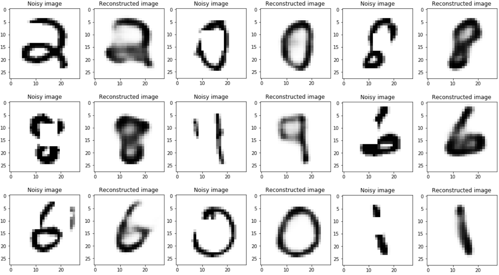

# Image Completion using Autoencoders

### The task was to complete an image whose pixel values are set to zero. To do so, I first modified the [MNIST](https://www.kaggle.com/c/digit-recognizer/data) data. 
In the given below image, the left image(noisy) is the modified image and the image right(reconstructed) to it is the output of the autoencoder.

I used 4 layer(748, 300, 150, 300, 784) autoencoder.
